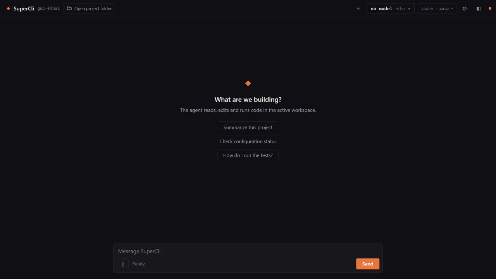
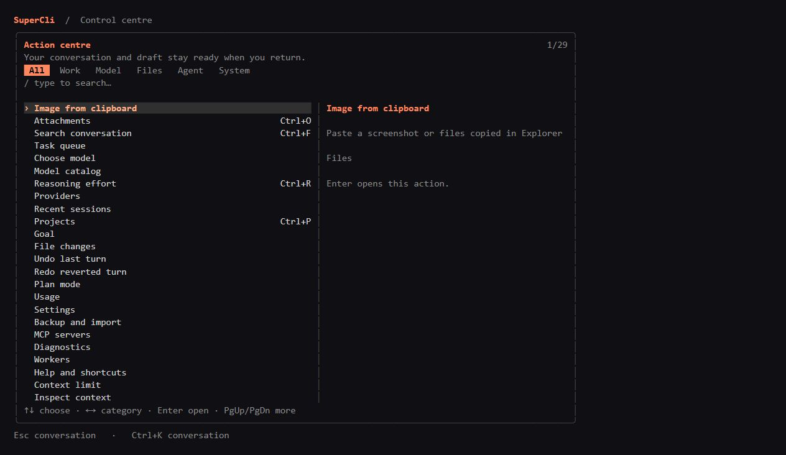

[English](en.md) · [Български](bg.md) · [Čeština](cs.md) · [Dansk](da.md) · [Deutsch](de.md) · [Ελληνικά](el.md) · [Español](es.md) · [Eesti](et.md) · [Suomi](fi.md) · [Français](fr.md) · [Hrvatski](hr.md) · [Magyar](hu.md) · [Italiano](it.md) · [Lietuvių](lt.md) · [Latviešu](lv.md) · [Norsk bokmål](nb.md) · [Nederlands](nl.md) · [Polski](pl.md) · [Português (Brasil)](pt-BR.md) · [Română](ro.md) · [Русский](ru.md) · [Slovenčina](sk.md) · [Slovenščina](sl.md) · [Srpski (latinica)](sr-Latn.md) · [Svenska](sv.md) · [Türkçe](tr.md) · [Українська](uk.md)

<!-- Generated from docs/readme/source.json and translations/*.json; edit those files, then run node docs/readme/generate.cjs. -->

# SuperCli 1.0.2

<!-- readme-unit:intro -->
Преносим AI агент за програмиране, написан на Go, с терминален интерфейс (TUI), настолен/уеб интерфейс (GUI) и пакетен режим, които използват общ двигател.

<!-- readme-unit:status -->
Този README описва версия `1.0.2`. Преносимите пакети се разпространяват чрез [GitHub Releases](https://github.com/snakex21/SuperCli/releases); локална компилация не означава, че съответната версия вече е публикувана.

<!-- readme-unit:h.screenshots -->
## Екранни снимки

<!-- readme-unit:screenshot.gui -->


<!-- readme-unit:screenshot.tui -->


<!-- readme-unit:screenshots.more -->
Изображението на GUI е екранна снимка; изображението на TUI е визуализация на действителното оформление на терминалния интерфейс на приложението. [Още екранни снимки](../screenshots/1.0.0/README.md).

<!-- readme-unit:h.start -->
## Първи стъпки

<!-- readme-unit:start -->
Разархивирайте пакета за вашата операционна система и архитектура в папка с права за запис. В Windows стартирайте `supercli.exe` за терминала или `supercli-web.exe` за GUI. Запазете включената папка `supercli-data/` до изпълнимите файлове.

```powershell
.\supercli.exe
.\supercli-web.exe
.\supercli.exe --home "D:\projects\example"
.\supercli.exe --batch "Summarize this project"
.\supercli.exe --doctor
```

<!-- readme-unit:start.other -->
В Linux или macOS използвайте съответния изпълним файл от пакета или компилирайте от изходния код. Изберете проекта с `--home`; използвайте `--batch` за една заявка без TUI.

```bash
./supercli --home ./my-project
./supercli --batch "Summarize this project"
./supercli --doctor
```

<!-- readme-unit:h.data -->
## Преносими данни

<!-- readme-unit:data -->
Настройките, сесиите, паметта, идентификационните данни, кешовете, журналите и резервните копия се съхраняват в `supercli-data/` до приложението. Преместете цялата папка на приложението, за да ги пренесете. Приложението не използва `%APPDATA%`, `%LOCALAPPDATA%` или системния регистър на Windows за собствените си данни.

<!-- readme-unit:workspace -->
`--home` и `SUPERCLI_HOME` избират работната област, без да местят данните на приложението. Проектните настройки и работните артефакти използват `<project>/.supercli/`.

<!-- readme-unit:override -->
Само изрично зададени `--data-dir` или `SUPERCLI_DATA_DIR` променят мястото за данни. Ако папката на приложението не позволява запис, стартирането съобщава грешка, вместо незабелязано да използва папка от потребителския профил.

<!-- readme-unit:legacy -->
При първото стартиране терминалът може да копира старите данни от `~/.supercli` в празна преносима папка, като запази оригинала. Вижте [структура на данните](../data-layout.md).

<!-- readme-unit:secrets -->
Идентификационните данни се пренасят с преносимата папка. Пазете я лична, създавайте резервни копия и никога не добавяйте API ключове или файлове за удостоверяване в публично хранилище.

<!-- readme-unit:h.config -->
## Модели и конфигурация

<!-- readme-unit:providers -->
Конфигурирайте доставчиците чрез настройките на GUI или TUI `/providers` и `/models`. Поддържат се OpenAI-съвместими крайни точки, нативен Anthropic, ChatGPT/Codex OAuth, шлюзове opencode и офлайн доставчик echo.

<!-- readme-unit:config -->
Глобалните настройки са в `supercli-data/config.toml`; `<project>/.supercli/config.toml` може да ги замени. Променливите на средата и флаговете на CLI имат предимство. Пример за локална крайна точка:

```toml
default_provider = "local"
default_model = "qwen"
language = "en"

[[providers]]
name = "local"
type = "openai"
base_url = "http://localhost:1234/v1"
api_key = "lm-studio"
model = "qwen"
```

<!-- readme-unit:config.note -->
Заменете примерната крайна точка и модела със стойностите на вашия сървър. Облачните услуги може да изискват удостоверяване и да таксуват използването. Възможностите на модела определят зрението, инструментите, разсъжденията и ограниченията на контекста. Вижте [конфигурация](../configuration.md).

<!-- readme-unit:h.features -->
## Възможности

<!-- readme-unit:surface -->
GUI и TUI поддържат едни и същи 27 езика на интерфейса. Те предоставят поточни разговори, възстановяване на сесии, избор на проект, управление на модели, прикачени файлове и статистика за използването. TUI поддържа превъртане с мишката, търсене в разговора и свиваем изход от разсъжденията/инструментите.

<!-- readme-unit:agent -->
Двигателят поддържа откриване на инструменти, проверени редакции на файлове, изпълнение на команди, история на сесиите, проектна памет, свиване на контекста, цели, делегиране на работни агенти, консултации и незадължителни чернови модели.

<!-- readme-unit:tools -->
Инструментите обхващат търсене в код, целеви четения и корекции на файлове, изображения, ZIP архиви, DOCX/XLSX/PDF документи и ограничено изпълнение в контекст. Наличните инструменти зависят от избрания профил и модел; използвайте откриването на инструменти за текущия каталог.

<!-- readme-unit:extensions -->
Незадължителните MCP пакети се намират в `supercli-data/mcp/` и се стартират при използване. Архивът с вградени умения е в `supercli-data/skills/builtin-skills.zip`; липсата му не пречи на нормалното стартиране. Разширенията може да изискват собствени среди за изпълнение или инсталирани приложения на хоста.

<!-- readme-unit:optional -->
Генерирането на кандидати Darwin, съветите и делегирането на работни агенти са незадължителни работни процеси. Паралелните заявки към модели може да увеличат ресурсите и разходите. Основният изпълним файл не изисква Node, Python, Docker или CGO.

<!-- readme-unit:h.controls -->
## Команди и управление

<!-- readme-unit:controls -->
Въведете `/` за палитрата с команди. Отворете центъра за действия на TUI с `Tab` при празно поле или `Ctrl+K`; използвайте стрелките за избор на действия и `Esc` за връщане.

<!-- readme-unit:table.command,table.action,cmd.help,cmd.models,cmd.sessions,cmd.context,cmd.goal,cmd.diff,cmd.parallel,cmd.update,cmd.quit -->
| Команда | Действие |
| --- | --- |
| `/help`, `/doctor` | Показване на помощ и диагностика. |
| `/model`, `/models`, `/providers` | Избор на модели и управление на доставчици. |
| `/resume`, `/export` | Продължаване или експортиране на разговор. |
| `/status`, `/cost`, `/compact` | Преглед на използването или свиване на контекста. |
| `/goal`, `/plan` | Управление на цели и режим за планиране само за четене. |
| `/diff`, `/undo`, `/redo` | Преглед на промените или отмяна/повторение на ход на агента. |
| `/darwin`, `/council` | Използване на незадължителни процеси с няколко модела. |
| `/update check\|download\|install` | Проверка, изтегляне или изрично инсталиране на актуализация. |
| `/quit`, `/exit` | Изход от приложението. |

<!-- readme-unit:keys -->
`Enter` изпраща заявка; `Ctrl+C` прекъсва. `PgUp`/`PgDn` и колелцето на мишката превъртат; `Ctrl+F` търси; `Shift+T` превключва разсъжденията; `Shift+E` разширява изхода от инструментите. Заявките, въведени по време на изпълнение, се поставят на опашка за безопасна следваща стъпка.

<!-- readme-unit:h.updates -->
## Актуализации

<!-- readme-unit:update.check -->
Проверявайте стабилните версии в GitHub при поискване от екрана About на GUI, TUI `/update check` или CLI `--check-update`. Проверката не инсталира нищо.

<!-- readme-unit:update.download -->
Изтеглянето подготвя съответния преносим пакет и проверява неговия SHA256 спрямо манифеста на версията. Изтеглянето от GUI и `/update download` запазват текущата инсталация.

<!-- readme-unit:update.install -->
Използвайте бутона за инсталиране в GUI или `/update install`, за да инсталирате подготвената актуализация. CLI `--update` изрично заявява изтегляне и инсталиране. Съществуващият `supercli-data/` се запазва, а заменените изпълними файлове получават локални резервни копия.

<!-- readme-unit:update.restart -->
Рестартирайте ръчно след инсталирането. Затворете другите копия преди инсталиране; работещите изпълними файлове може да са заключени в Windows. Ако съответният пакет или метаданните за проверка липсват, използвайте проверено ръчно изтегляне на версията. Пазете собствено резервно копие на данните.

```powershell
.\supercli.exe --check-update
.\supercli.exe --update
```

<!-- readme-unit:h.docs -->
## Документация

<!-- readme-unit:docs.start -->
Започнете с [индекса на документацията](../README.md), [бързото начало](../quickstart.md), [структурата на данните](../data-layout.md) и [конфигурацията](../configuration.md).

<!-- readme-unit:docs.engine -->
Прочетете [архитектурата](../architecture.md), [делегирането](../delegation.md), [производителността](../performance.md), [дизайна на GUI](../webgui.md) и [структурата на проекта](../project-structure.md) за подробности по реализацията.

<!-- readme-unit:docs.extra -->
Ръководства за функции: [преносим MCP](../portable-mcp.md), [вградени умения](../builtin-skills.md) и [телеметрия](../telemetry.md). Проследяване на разработката: [план](../PLAN.md) и [пътна карта](../ROADMAP.md).

<!-- readme-unit:reference -->
[Предишният пълен README](../readme-reference.md) е запазен като историческа справка; по-старите описания на функции може да предхождат версия `1.0.0`.

<!-- readme-unit:h.build -->
## Компилиране и проверка

<!-- readme-unit:build -->
Използвайте версията на Go, посочена в `go.mod`. В Windows `build.bat` компилира TUI, `build_ui.bat` компилира GUI, а `run.bat` компилира при нужда и стартира терминала.

[docs/releasing.md](../releasing.md)

```bash
go test ./...
go build -o supercli ./cmd/supercli
go build -o supercli-web ./cmd/supercli-web
node docs/readme/check.cjs
```

```powershell
go test ./...
go build -o supercli.exe ./cmd/supercli
go build -ldflags="-H windowsgui" -o supercli-web.exe ./cmd/supercli-web
node docs/readme/check.cjs
```

<!-- readme-unit:tests -->
Изпълнете тестовете на Go преди публикуване. Проверяващият скрипт за документация проверява всички 27 превода, съответствието на съдържанието, заглавията, връзките, техническите литерали и еднаквите примери с код.

<!-- readme-unit:requirements -->
Нормалното използване изисква конфигурирана крайна точка за модел или акаунт. Git и ripgrep подобряват работата с хранилища; външните инструменти са незадължителни, освен ако процесът не ги изисква. GUI допълнително изисква поддръжка на webview/браузър за платформата. Използвайте `--doctor` за диагностика на инсталацията.

<!-- readme-unit:h.license -->
## Лиценз

<!-- readme-unit:license -->
SuperCli използва [лиценза MIT](../../LICENSE). Включените зависимости и съдържание имат собствени бележки; вижте [бележките за трети страни](../../THIRD_PARTY_NOTICES.md) и [ръководството за умения](../builtin-skills.md).
