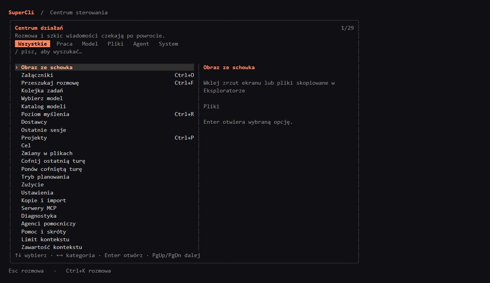

[English](en.md) · [Български](bg.md) · [Čeština](cs.md) · [Dansk](da.md) · [Deutsch](de.md) · [Ελληνικά](el.md) · [Español](es.md) · [Eesti](et.md) · [Suomi](fi.md) · [Français](fr.md) · [Hrvatski](hr.md) · [Magyar](hu.md) · [Italiano](it.md) · [Lietuvių](lt.md) · [Latviešu](lv.md) · [Norsk bokmål](nb.md) · [Nederlands](nl.md) · [Polski](pl.md) · [Português (Brasil)](pt-BR.md) · [Română](ro.md) · [Русский](ru.md) · [Slovenčina](sk.md) · [Slovenščina](sl.md) · [Srpski (latinica)](sr-Latn.md) · [Svenska](sv.md) · [Türkçe](tr.md) · [Українська](uk.md)

<!-- Generated from docs/readme/source.json and translations/*.json; edit those files, then run node docs/readme/generate.cjs. -->

# SuperCli 1.0.0

<!-- readme-unit:intro -->
Un agente di programmazione IA portatile scritto in Go, con interfaccia terminale (TUI), interfaccia desktop/web (GUI) e modalità batch che condividono un unico motore.

<!-- readme-unit:status -->
Questo README descrive la versione `1.0.0`. I pacchetti portatili vengono distribuiti tramite [GitHub Releases](https://github.com/snakex21/SuperCli/releases); una compilazione locale non implica che la relativa versione sia già pubblicata.

<!-- readme-unit:h.screenshots -->
## Schermate

<!-- readme-unit:screenshot.gui -->


<!-- readme-unit:screenshot.tui -->


<!-- readme-unit:screenshots.more -->
L’immagine della GUI è una schermata; l’immagine della TUI è una rappresentazione della disposizione effettiva del terminale dell’applicazione. [Altre schermate](../screenshots/1.0.0/README.md).

<!-- readme-unit:h.start -->
## Per iniziare

<!-- readme-unit:start -->
Estrai il pacchetto per il tuo sistema operativo e la tua architettura in una cartella scrivibile. Su Windows avvia `supercli.exe` per il terminale o `supercli-web.exe` per la GUI. Mantieni la cartella inclusa `supercli-data/` accanto agli eseguibili.

```powershell
.\supercli.exe
.\supercli-web.exe
.\supercli.exe --home "D:\projects\example"
.\supercli.exe --batch "Summarize this project"
.\supercli.exe --doctor
```

<!-- readme-unit:start.other -->
Su Linux o macOS usa l'eseguibile corrispondente del pacchetto o compila dai sorgenti. Seleziona il progetto con `--home`; usa `--batch` per una richiesta senza TUI.

```bash
./supercli --home ./my-project
./supercli --batch "Summarize this project"
./supercli --doctor
```

<!-- readme-unit:h.data -->
## Dati portatili

<!-- readme-unit:data -->
Impostazioni, sessioni, memoria, credenziali, cache, registri e backup risiedono in `supercli-data/` accanto all'applicazione. Sposta tutta la cartella dell'applicazione per portarli con te. L'applicazione non usa `%APPDATA%`, `%LOCALAPPDATA%` o il registro Windows per il proprio stato.

<!-- readme-unit:workspace -->
`--home` e `SUPERCLI_HOME` selezionano lo spazio di lavoro senza spostare i dati dell'applicazione. Le impostazioni specifiche del progetto e i relativi artefatti usano `<project>/.supercli/`.

<!-- readme-unit:override -->
Solo `--data-dir` o `SUPERCLI_DATA_DIR` espliciti cambiano la posizione dei dati. Se la cartella dell'applicazione non è scrivibile, l'avvio segnala un errore invece di usare silenziosamente una cartella del profilo.

<!-- readme-unit:legacy -->
Al primo avvio il terminale può copiare i vecchi dati da `~/.supercli` in una directory portatile vuota, conservando l'originale. Vedi [organizzazione dei dati](../data-layout.md).

<!-- readme-unit:secrets -->
Le credenziali viaggiano con la cartella portatile. Mantienila privata, esegui backup e non inserire mai chiavi API o file di autenticazione in un repository pubblico.

<!-- readme-unit:h.config -->
## Modelli e configurazione

<!-- readme-unit:providers -->
Configura i provider dalle impostazioni GUI o con TUI `/providers` e `/models`. Sono supportati endpoint compatibili con OpenAI, Anthropic nativo, ChatGPT/Codex OAuth, gateway opencode e un provider echo offline.

<!-- readme-unit:config -->
Le impostazioni globali sono in `supercli-data/config.toml`; `<project>/.supercli/config.toml` può sovrascriverle. Variabili d'ambiente e opzioni CLI hanno precedenza. Esempio di endpoint locale:

```toml
default_provider = "local"
default_model = "qwen"
language = "en"

[[providers]]
name = "local"
type = "openai"
base_url = "http://localhost:1234/v1"
api_key = "lm-studio"
model = "qwen"
```

<!-- readme-unit:config.note -->
Sostituisci endpoint e modello d'esempio con i valori del tuo server. I servizi cloud possono richiedere credenziali e addebitare l'utilizzo. Le capacità del modello determinano visione, strumenti, ragionamento e limiti del contesto. Vedi [configurazione](../configuration.md).

<!-- readme-unit:h.features -->
## Funzionalità

<!-- readme-unit:surface -->
GUI e TUI supportano le stesse 27 lingue d'interfaccia. Offrono conversazioni in streaming, ripristino delle sessioni, scelta dei progetti, gestione dei modelli, allegati e viste dell'utilizzo. La TUI supporta scorrimento con mouse, ricerca nella conversazione e output di ragionamento/strumenti comprimibile.

<!-- readme-unit:agent -->
Il motore supporta scoperta degli strumenti, modifiche ai file verificate, esecuzione di comandi, cronologia delle sessioni, memoria di progetto, compattazione del contesto, obiettivi, delega ad agenti operativi, consultazione e modelli di bozza opzionali.

<!-- readme-unit:tools -->
Gli strumenti coprono ricerca nel codice, letture e patch mirate, immagini, archivi ZIP, documenti DOCX/XLSX/PDF ed esecuzione del contesto limitata. Gli strumenti disponibili dipendono dal profilo e modello scelti; usa la scoperta degli strumenti per il catalogo attuale.

<!-- readme-unit:extensions -->
I pacchetti MCP opzionali risiedono in `supercli-data/mcp/` e partono quando usati. L'archivio delle competenze integrate è in `supercli-data/skills/builtin-skills.zip`; la sua assenza non impedisce il normale avvio. Le estensioni possono richiedere propri runtime o applicazioni host installate.

<!-- readme-unit:optional -->
Generazione di candidati Darwin, consigli e delega ad agenti operativi sono flussi opzionali. Le chiamate parallele ai modelli possono aumentare consumo di risorse e costi. L'eseguibile principale non richiede Node, Python, Docker o CGO.

<!-- readme-unit:h.controls -->
## Comandi e controlli

<!-- readme-unit:controls -->
Digita `/` per la tavolozza dei comandi. Apri il centro azioni TUI con `Tab` a input vuoto o `Ctrl+K`; seleziona con le frecce e torna indietro con `Esc`.

<!-- readme-unit:table.command,table.action,cmd.help,cmd.models,cmd.sessions,cmd.context,cmd.goal,cmd.diff,cmd.parallel,cmd.update,cmd.quit -->
| Comando | Azione |
| --- | --- |
| `/help`, `/doctor` | Mostra aiuto e diagnostica. |
| `/model`, `/models`, `/providers` | Scegli modelli e gestisci provider. |
| `/resume`, `/export` | Riprendi o esporta una conversazione. |
| `/status`, `/cost`, `/compact` | Esamina l'utilizzo o compatta il contesto. |
| `/goal`, `/plan` | Gestisci obiettivi e modalità piano in sola lettura. |
| `/diff`, `/undo`, `/redo` | Esamina modifiche o annulla/ripeti un turno dell'agente. |
| `/darwin`, `/council` | Usa flussi opzionali con più modelli. |
| `/update check\|download\|install` | Verifica, scarica o installa esplicitamente un aggiornamento. |
| `/quit`, `/exit` | Esci dall'applicazione. |

<!-- readme-unit:keys -->
`Enter` invia una richiesta; `Ctrl+C` interrompe. `PgUp`/`PgDn` e la rotella del mouse scorrono; `Ctrl+F` cerca; `Shift+T` alterna il ragionamento; `Shift+E` espande l'output degli strumenti. Le richieste inserite durante l'esecuzione vengono accodate per il prossimo passaggio sicuro.

<!-- readme-unit:h.updates -->
## Aggiornamenti

<!-- readme-unit:update.check -->
Verifica su richiesta le versioni stabili GitHub dalla schermata About della GUI, da TUI `/update check` o da CLI `--check-update`. La verifica non installa nulla.

<!-- readme-unit:update.download -->
Il download prepara il pacchetto portatile corrispondente e verifica il suo SHA256 contro il manifesto della versione. Il download GUI e `/update download` lasciano al suo posto l'installazione in esecuzione.

<!-- readme-unit:update.install -->
Usa il pulsante d'installazione GUI o `/update install` per installare l'aggiornamento preparato. CLI `--update` richiede esplicitamente download e installazione. L'attuale `supercli-data/` viene conservato e gli eseguibili sostituiti vengono salvati in backup locali.

<!-- readme-unit:update.restart -->
Riavvia manualmente dopo l'installazione. Chiudi le altre copie prima di installare; Windows può bloccare gli eseguibili in uso. Se manca un pacchetto adatto o i metadati di verifica, usa un download manuale verificato della versione. Conserva un tuo backup dei dati.

```powershell
.\supercli.exe --check-update
.\supercli.exe --update
```

<!-- readme-unit:h.docs -->
## Documentazione

<!-- readme-unit:docs.start -->
Inizia da [indice della documentazione](../README.md), [avvio rapido](../quickstart.md), [organizzazione dei dati](../data-layout.md) e [configurazione](../configuration.md).

<!-- readme-unit:docs.engine -->
Leggi [architettura](../architecture.md), [delega](../delegation.md), [prestazioni](../performance.md), [design GUI](../webgui.md) e [struttura del progetto](../project-structure.md) per i dettagli implementativi.

<!-- readme-unit:docs.extra -->
Guide alle funzionalità: [MCP portatile](../portable-mcp.md), [competenze integrate](../builtin-skills.md) e [telemetria](../telemetry.md). Monitoraggio dello sviluppo: [piano](../PLAN.md) e [tabella di marcia](../ROADMAP.md).

<!-- readme-unit:reference -->
Il [precedente README completo](../readme-reference.md) viene conservato come riferimento storico; le vecchie descrizioni possono precedere la versione `1.0.0`.

<!-- readme-unit:h.build -->
## Compilazione e verifica

<!-- readme-unit:build -->
Usa la versione Go indicata in `go.mod`. Su Windows, `build.bat` compila la TUI, `build_ui.bat` la GUI e `run.bat` compila se necessario e avvia il terminale.

[docs/releasing.md](../releasing.md)

```bash
go test ./...
go build -o supercli ./cmd/supercli
go build -o supercli-web ./cmd/supercli-web
node docs/readme/check.cjs
```

```powershell
go test ./...
go build -o supercli.exe ./cmd/supercli
go build -ldflags="-H windowsgui" -o supercli-web.exe ./cmd/supercli-web
node docs/readme/check.cjs
```

<!-- readme-unit:tests -->
Esegui i test Go prima di una pubblicazione. Il verificatore della documentazione controlla tutte le 27 traduzioni, i contenuti associati, titoli, link, letterali tecnici ed esempi di codice identici.

<!-- readme-unit:requirements -->
L'uso normale richiede un endpoint di modello configurato o un account. Git e ripgrep migliorano i flussi dei repository; gli strumenti esterni sono opzionali salvo che un flusso li richieda. La GUI necessita anche del supporto webview/browser della piattaforma. Usa `--doctor` per diagnosticare l'installazione.

<!-- readme-unit:h.license -->
## Licenza

<!-- readme-unit:license -->
SuperCli usa la [licenza MIT](../../LICENSE). Dipendenze e contenuti inclusi hanno le proprie note; vedi [note di terze parti](../../THIRD_PARTY_NOTICES.md) e [guida alle competenze](../builtin-skills.md).
