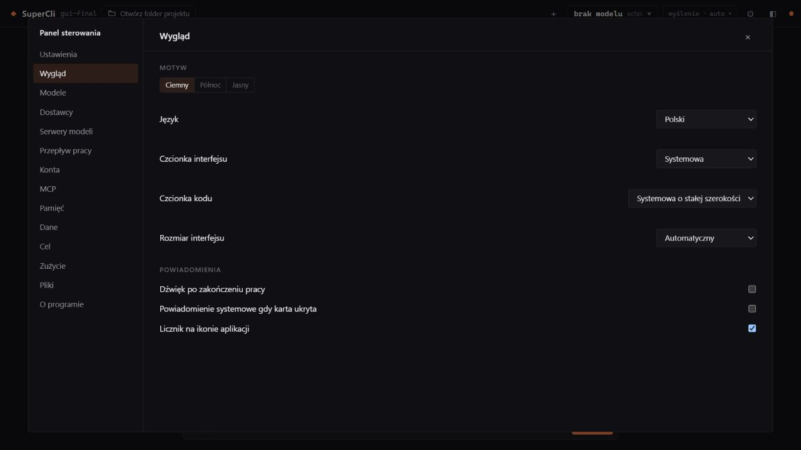
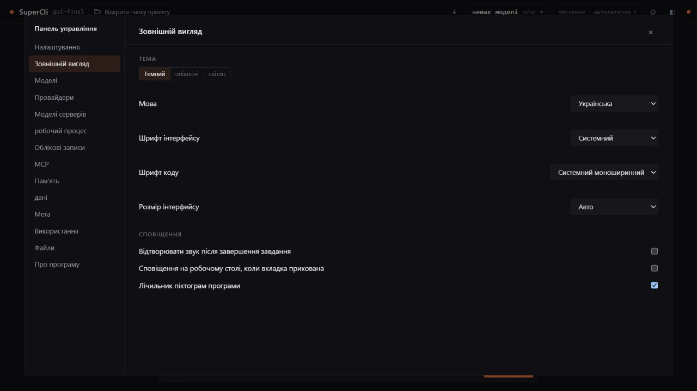
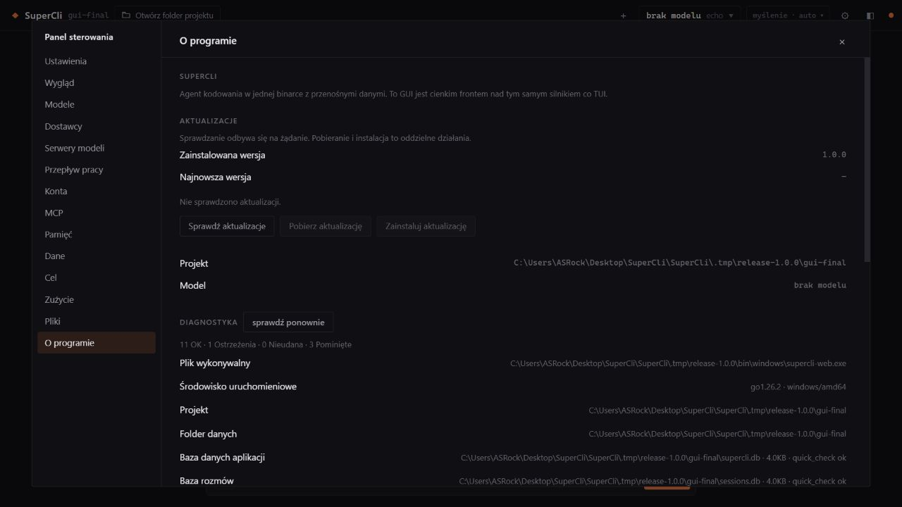
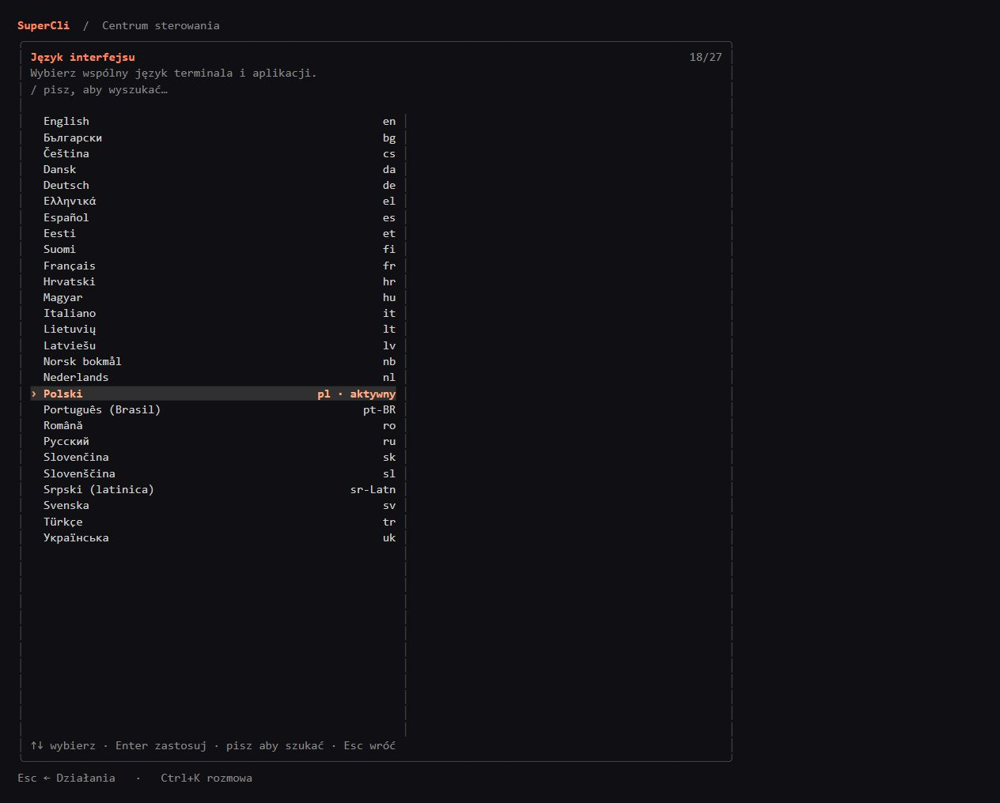

# SuperCli 1.0.0 screenshots

These captures use an isolated portable workspace with the offline echo provider. They contain no user sessions or credentials.

## GUI

The GUI images are captures of the running Windows build in the browser.








## TUI

The terminal examples are rendered from the production `Model.View()` output, including ANSI colors. They show the actual layout with synthetic data; they are not screenshots of a native terminal window. Fonts and emoji support depend on the user's terminal.




## Reproduce

The export test writes only inside repository `.tmp/`:

```powershell
$env:SUPERCLI_TUI_SCREENSHOT_DIR = (Join-Path $PWD '.tmp/release-1.0.0/tui-screenshots')
go test ./internal/ui/tui -run '^TestExportTUIScreenshots$' -count=1
node scripts/tui-screenshots.cjs .tmp/release-1.0.0/tui-screenshots .tmp/release-1.0.0/tui-screenshots/html
```

Capture the generated HTML pages in the browser. The GUI can be run with `--no-window --echo --data-dir <isolated-directory>`.
