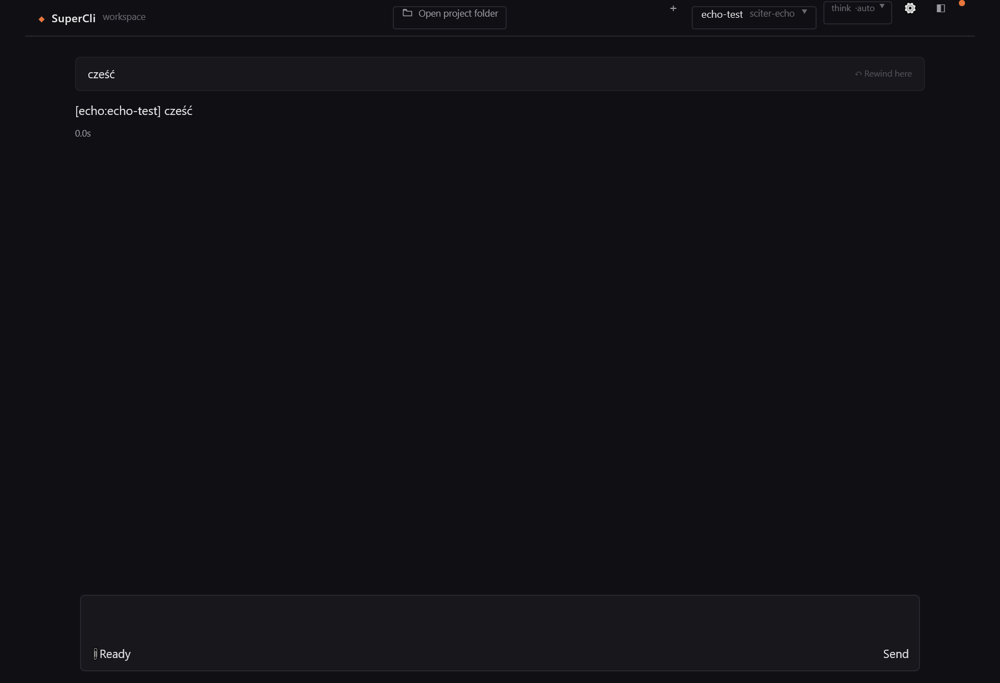

# Sciter preview (Windows x64)

An opt-in native GUI experiment that runs the existing SuperCli HTML/CSS/JavaScript in Sciter.JS 6.0.5.1 Direct2D, with the same Go agent backend. The production GUI remains WebView2. No Python, Node.js, additional Go dependency, provider fork, or extra model prompt is introduced.

Sources: [Sciter documentation](https://docs.sciter.com/) and the [pinned SDK with its licenses](https://gitlab.com/sciter-engine/sciter-js-sdk/-/tree/2a890cde76e178cd159fbfbe696cc0959621e4b7).

## Build and run

From the repository root in PowerShell:

~~~powershell
.\experiments\sciter\build.ps1
.\.tmp\sciter-preview\supercli-sciter.exe
~~~

The builder downloads a pinned, SHA-256-checked Sciter runtime and its licenses. Build caches stay in the repository's .tmp folder. Deployment requires supercli-sciter.exe and the adjacent sciter-runtime folder. The measured stripped launcher is about 21.1 MiB, and the runtime is 9.2 MiB: about 30.3 MiB total, compared with the existing GUI's 21.2 MiB. Sciter's engine is distributed under its own EULA; the application includes the required attribution.

The preview starts with the explicitly configured, offline sciter-echo provider and uses a separate trial-data folder next to its executable. It neither imports nor overwrites the production application's data. UI assets and dictionaries are taken from the same embedded frontend as production; only the adapter and layout overrides are specific to Sciter. Files are loaded locally, and JSON/SSE requests go directly to the loopback Go server through asynchronous TCP, avoiding the Windows WinINET cache path. Closing the Sciter window stops this launcher and its backend.

## Automated checks

~~~powershell
.\.tmp\sciter-preview\supercli-sciter.exe --smoke 2>&1 | Out-Host
.\.tmp\sciter-preview\supercli-sciter.exe --compare-webview 2>&1 | Out-Host
~~~

Each smoke run creates an adjacent smoke-data-* folder, prints a JSON result, and closes its window. The result and Sciter preview.png are kept in that folder. Checks cover an actual engine echo turn, selected model, split UTF-8/SSE frames, progressive delivery, cancellation, provider presets, appearance, language switching, session transcript/runtime restoration, composer submission events, and the main layout. They call no external model. Sciter's native programmatic click() is different from the browser's; its submission test dispatches the DOM click event used by the preview handler. Physical mouse and keyboard input still need manual coverage.

Memory is sampled before taking the PNG, across the entire process tree, after a fixed four-second idle interval. The windows use approximately the same 1200×820 CSS viewport at 150% Windows scaling. PrivateWorkingSet counts resident pages that are not shared; Private counts committed private memory. The engine and renderer both contribute to the reported totals. The WebView2 comparison is a minimal host using production's Glaze dependency; it is not a measurement of a user's existing conversation or its complete desktop integrations.

The last recorded samples are in results/. Private resident memory varied substantially between runs, especially with WebView2. The broader tests observed roughly 57–63 MiB for Sciter and 66–142 MiB for WebView2. Sciter's private committed memory was higher. Do not infer a universal RAM percentage, lower total memory commitment, or a faster model/prompt processor from this experiment.

## Remaining compatibility work

This is a preview, not a replacement release. Multipart FormData/Blob uploads, clipboard images, drag and drop, attachment/PDF previews, document export, update/install flows, taskbar badges, desktop notifications, accessibility, resizing, and complete mouse/keyboard interaction are not validated. The adapter intentionally implements only the HTTP/DOM functionality used by the tested workflows. Test it on Windows before expanding functionality; Linux and macOS are not built or tested here. OpenCode Zen's provider implementation is unchanged.

The trial also exposed a shared frontend issue: the providers section did not return its asynchronous render promise. It now returns that promise, allowing the control panel's existing completion guard to work when tabs change.
